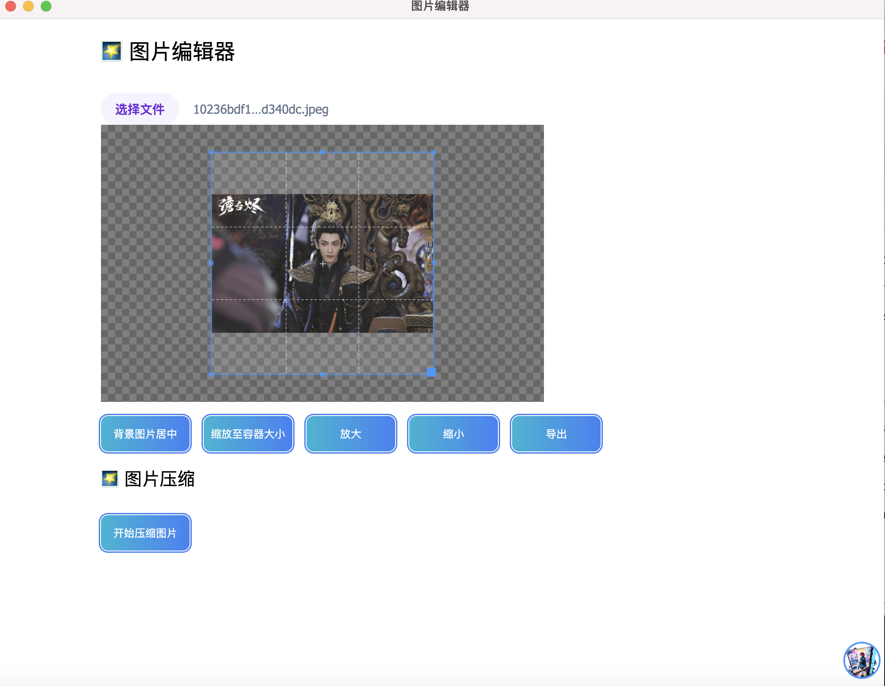
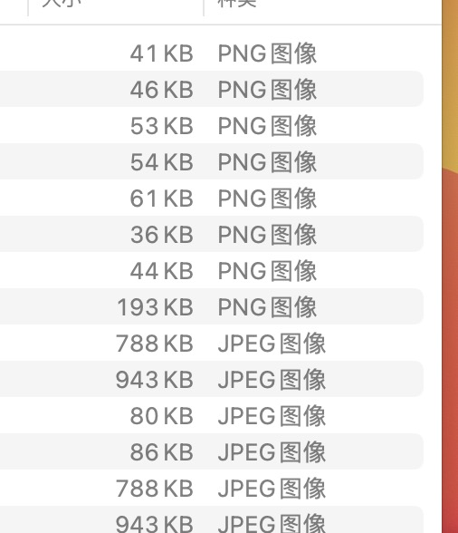

# electron 图片裁剪工具

electron + webpack 具备前端工程化的 图片裁剪工具,通过 cropperjs 实现

# 功能

- 图片裁剪
- 图片放大缩小
- 图片导出功能
- 图片居中裁剪居住
- todo 拖拽上传
- 图片压缩
- todo 自定义尺寸

## 图片压缩

图片压缩会默认在桌面 imageDist 文件内

## 安装包直接下载

pageckage 目录下 MAC 版本下载

- Windows 可以自己 git 项目执行 make 安卓

## 预览

